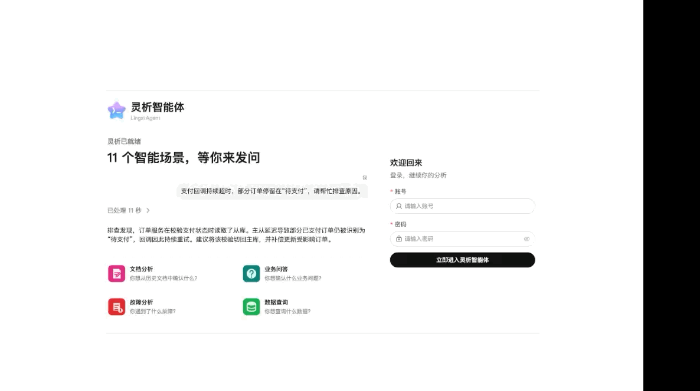
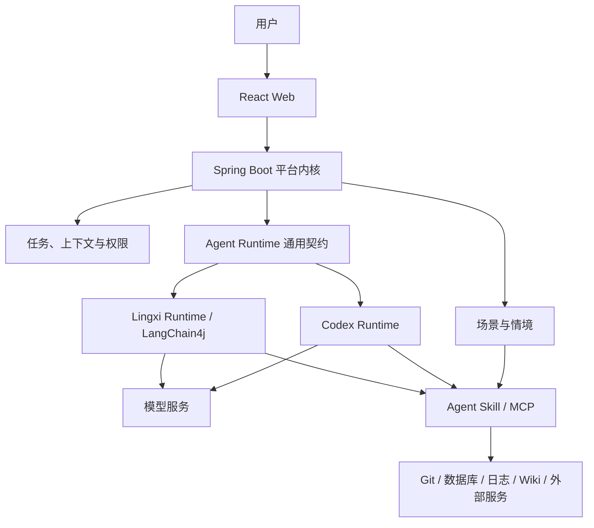

  

<h1 align="center">灵析智能体</h1>

Lingxi Agent

  
  
  
  
  

灵析智能体是一个面向多人协作的自托管、多 Runtime Web Agent 平台。平台将场景、标准 Agent Skill、模型接入、Agent Runtime、任务状态、上下文和权限分开管理，让同一套平台可以按团队需要组合成不同用途的智能体。

> 项目当前处于开发阶段，接口、数据库结构和定义协议仍可能调整，暂未发布稳定版本。

  

## 核心特点

- **平台内核不绑定业务**：项目中心、代码仓库、日志、Wiki、数据库等都不是平台业务逻辑，通过独立 Skill 接入，不需要修改 Lingxi 内核。
- **Skill 可以自主扩展**：按照标准 Agent Skill 目录开发能力，再用 `lingxi.json` 补充 Lingxi 的展示、参数和公开命令；默认 Skill 可以替换，外置 Skill 可以独立安装和更新。
- **场景可以自主组合**：场景定义用户入口、任务参数、可用 Skill 和交付要求。同一个 Skill 可以被多个场景复用，同一个场景也可以组合多个 Skill 与 MCP。
- **Runtime 可以替换**：Codex Runtime 与 Lingxi Runtime 使用相同的场景、Skill、模型和权限配置，平台业务流程不依赖某个 Agent 引擎。
- **面向团队自托管**：统一管理用户、模型供应商、Runtime、任务上下文、权限、执行记录和结果，成员通过浏览器使用，无需各自维护一套 Agent 环境。

因此，Lingxi 不是预先写死用途的业务智能体。部署方可以根据个人或公司的系统开发 Skill，再通过场景把能力组合成研发协作、故障分析、业务问答、文档分析或其他智能体。

## 平台架构

平台内核负责确定性的任务状态、权限和运行基础设施；场景定义用户入口和交付要求；Skill 与 MCP 提供独立能力；Runtime 负责驱动模型并在授权范围内调用能力。具体架构边界和执行链路请阅读[开发说明](https://lingxi.fusb.top/development.html)。

## 文档

- [项目网站](https://lingxi.fusb.top/)：项目定位与平台架构
- [体验部署](https://lingxi.fusb.top/deploy.html)：启动服务、初始化管理员、配置模型与 Runtime
- [使用说明](https://lingxi.fusb.top/usage.html)：选择场景与情境、发起任务、查看过程与结果
- [开发说明](https://lingxi.fusb.top/development.html)：开发、校验、打包和安装 Skill 与场景

完整的部署、使用和扩展开发说明统一维护在文档网站。

## 仓库

- 问题反馈：[GitHub Issues](https://github.com/shuangbofu/lingxi-agent/issues)
- 安全问题：[SECURITY.md](./SECURITY.md)
- 参与贡献：[CONTRIBUTING.md](./CONTRIBUTING.md)
- 开源许可：[MIT License](./LICENSE)
