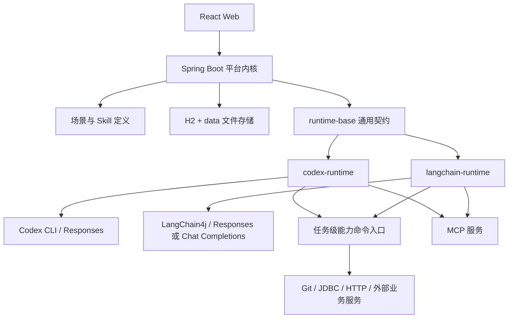
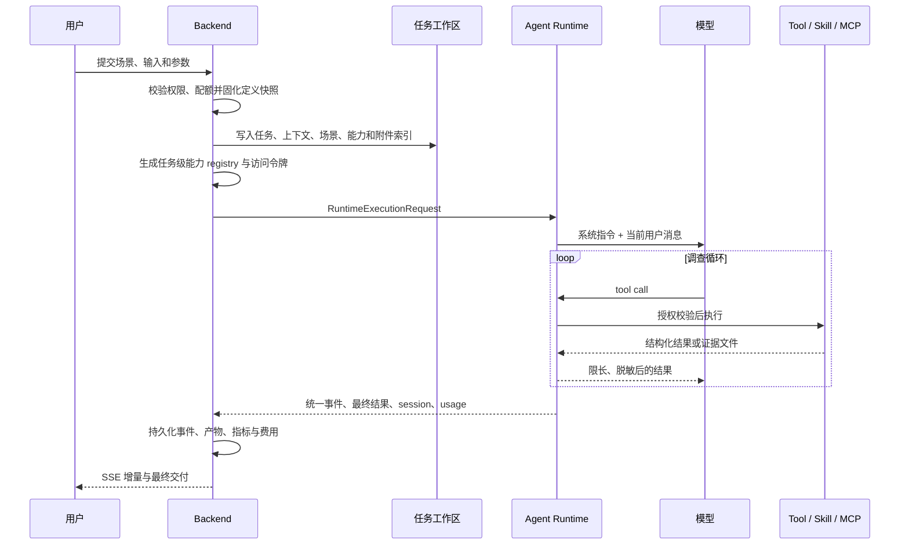

# Lingxi 核心架构

本文描述当前代码的核心实现，重点覆盖任务执行、Tool Call、上下文处理和 Runtime 划分。平台与业务模块的禁止依赖仍以 [`architecture-boundary.md`](./architecture-boundary.md) 为准；能力包开发协议见 [`capability-development.md`](./capability-development.md)。

## 1. 架构目标

Lingxi 是一个自托管 Agent 平台，不是某个业务系统的固定智能体。平台负责确定性状态、安全和运行基础设施；场景定义任务入口与交付契约；Skill 提供可组合能力；Runtime 决定如何驱动模型、工具循环和会话。



核心约束：

- `backend` 不实现具体 Agent loop，也不按业务能力编码写分支。
- Runtime 不读取 JPA 实体，不决定场景、权限和能力绑定。
- Skill 不声明所属场景，也不调用另一个 Skill 的私有实现。
- Codex 和 LangChain 消费同一份 `RuntimeExecutionRequest` 与 `RuntimeExecutionEnvironment`。
- Tool、CLI 和 MCP 返回均是不可信数据，不能改变平台授权边界。

## 2. 代码与职责划分

### 2.1 前端

`frontend/` 负责登录、场景任务表单、任务事件、交互、结果、能力与 Runtime 配置。前端只消费通用 API，不解析 Skill 私有协议，也不能以隐藏组件代替权限控制。

### 2.2 Backend 平台内核

`backend/` 的核心职责分为：

- `service/`、`definition/`：加载场景、默认 Skill 和已安装外置 Skill，同步平台定义。
- `task/`：创建任务快照、准备工作区、调度、恢复、事件、附件、产物和最终结果。
- `prompt/`：将稳定指令与不可信本轮输入拆成不同消息角色。
- `runtime/execution/`：把平台任务映射为通用 Runtime 请求。
- `runtime/capability/`：按任务授权安装 Skill、生成命令 registry、私有 launcher 和短期访问令牌。
- `runtime/core/`：发现、选择和调用 `AgentRuntime`，统一脱敏 Runtime 事件与结果。
- `runtime/mcp/`：保存 MCP 配置，并按 Runtime 与资源特征选择本次挂载项。

Backend 是任务状态和授权的唯一权威来源。Runtime session、能力命令和 MCP 都只能在 Backend 固化的任务快照内工作。

场景和 Skill 的固定定义只存在于 `data/installed-scenarios/<code>` 与 `data/installed-skills/<code>`。Backend 展示和执行时直接解析这些文件；H2 只保存启停、可见性、排序、场景 Skill/command code 授权等可变状态。任务、分析情境和接入配置直接引用稳定 code，任务开始后再保存不可变的执行快照。

### 2.3 Runtime 模块

```text
runtime/
  runtime-base/       纯 Java 通用 API、请求、事件、会话、用量和维护契约
  codex-runtime/      Codex CLI 配置、进程、事件解析、session 与 CLI 维护
  langchain-runtime/  LangChain4j Agent loop、Tool、MCP、文件、记忆与压缩
  runtime-bundle/     将可用 Runtime 实现装配进应用
```

`runtime-base` 不依赖 Spring、JPA、Backend 实体或具体 Agent 框架。具体 Runtime 通过各自的 Spring Boot auto-configuration 注册，Backend 的 `AgentRuntimeRegistry` 只按 `code` 发现实现。

`AgentRuntime` 的核心契约包括：执行、取消、默认超时、会话查询、用量、费用估算和可选维护。增加 Runtime 时不应修改任务业务流程或在 Backend 新增 Runtime 专用 Bean。

## 3. 任务执行链



具体步骤：

1. `TaskService` 根据场景、分析情境、用户输入和模型配置创建任务，并固化场景、能力、Prompt 和模型快照。
2. `TaskAgentWorkspaceService` 创建 `.agent-task/`，写入稳定任务文件、结构化上下文、附件索引、能力目录和恢复检查点。
3. `CapabilityRuntimeScriptService` 只安装当前任务启用且场景允许的能力命令，生成 `RuntimeExecutionEnvironment`。
4. Backend 根据能力命令声明的输出 `features` 选择本次可挂载的 MCP。
5. `TaskRuntimeService` 组装 `RuntimeExecutionRequest`，其中包含消息角色、工作区布局、模型配置、能力授权、MCP、环境、session 和超时。
6. `AgentRuntimeService` 调用选定 Runtime，并在事件、消息增量和最终结果离开 Runtime 时统一脱敏。
7. `TaskRunner` 持久化标准化事件、结果、用量和执行状态。

## 4. Tool Call 与能力调用

### 4.1 任务级能力环境

能力安装不是把所有 Skill 全局放进模型环境。每次执行都会根据场景授权生成私有任务目录，其中包含：

- 当前任务允许的 Skill 副本。
- `registry.json` 中的 Skill、公开命令、私有入口和输出绑定。
- `bin/<group>` 公开命令 shim。
- 统一 `capability` launcher 和注入的 `capability_runtime.py`。
- 任务级短期访问令牌、工作区路径、Python 依赖缓存信息和敏感值集合。

公开调用链为：

```text
模型选择 group action
  -> Runtime 校验当前任务是否挂载 Skill 和命令
  -> bin/<group> shim
  -> 私有 launcher 查 registry
  -> 唯一 entrypoint 接收 group.action + 参数
  -> stdout / stderr / exit code
  -> Runtime 绑定资源、限长、脱敏并生成事件
```

场景可以只授权一个 Skill 的部分命令。未挂载的 Skill、未授权命令、重复命令或格式不合法的命令都会在执行前被拒绝。

### 4.2 Codex Runtime

Codex Runtime 为会话准备隔离 `CODEX_HOME`，写入模型、鉴权、MCP 和 Skill 投影：

- 原生 Skill 模式只投影 `SKILL.md` 与 `references/`，不暴露 `scripts/` 和 `lingxi.json`。
- 命令目录模式把相同说明投影成 Runtime 私有 command catalog。
- 能力公开命令目录加入 `PATH`，Codex 按 `SKILL.md` 执行 `group action`。
- Codex CLI JSONL 事件由 Runtime 解析并转换成统一 `RuntimeEvent`、`RuntimeUsage` 和 `RuntimeExecutionResult`。

模型的 Shell 能力属于 Codex Runtime 实现细节。Skill 契约不能假设某个宿主机绝对路径，也不能绕过公开命令去执行私有入口。

当前能力 launcher 固定使用 Python 解释器执行 `lingxi.json.entrypoint`。Codex Runtime 和 LangChain Runtime 都只调用 launcher 暴露的公开命令，不直接执行 Skill 包中的 Shell、Node 或 Java 文件。

### 4.3 LangChain Runtime

LangChain Runtime 使用 LangChain4j 原生 Tool loop，工具来源分为三组：

1. Runtime 内置工具：`read_skill_file`、`run_skill_command`、受管文件读写与查询。
2. 平台原生命令：从 `RuntimeCommandDescriptor` 动态生成 JSON Schema 和 Tool executor，例如资源记忆。
3. MCP 工具：由本次任务选择的 MCP server 动态提供。

首次使用 Skill 时，模型通过 `read_skill_file` 读取 `SKILL.md`；执行时只向 `run_skill_command` 传完整 `group action` 和参数数组。`LangChainCapabilityRegistry` 同时验证 Skill、命令和输出绑定，`LangChainProcessRunner` 在任务工作区启动进程并负责超时与取消。

同一模型轮次中互不依赖的 Tool Call 由受限线程池并发执行；有参数依赖或读写冲突的调用必须分轮。Runtime 对工具总次数、重复能力调用、模型 Token、执行超时和最终交付预留都设置硬限制。

### 4.4 输出与资源

能力 stdout 较小时直接回传；过大时 launcher 会把完整内容写入任务产物目录，并只返回预览、文件位置和原始大小。LangChain 还会把过长 Tool 结果存入 evidence 目录，返回可继续查询的摘要。

命令通过 `lingxi.json commands.outputs` 声明结构化资源。该声明在两个阶段生效：Backend 在执行前汇总 `features` 并选择可挂载的 MCP；LangChain 在命令执行后从 stdout JSON 的 `pathField` 读取位置，并向工具结果附加统一 `runtimeResources`。Codex 使用相同的公开命令和预挂载 MCP，但不经过 LangChain 的 Tool 结果包装。

- `file-access` 允许 LangChain 将目录注册为受管只读文件根。
- 其他 `features` 可用于匹配 MCP 或 Runtime 后处理。
- Runtime 只理解通用类型与特征，不解释具体业务字段。

### 4.5 MCP 与能力的边界

MCP 是 Runtime 工具来源，不是能力脚本协议。能力只声明自己产出的通用资源特征，不知道哪个 MCP 会消费；Runtime 根据特征和配置决定是否挂载 MCP。MCP 的业务使用说明由 Backend 注入任务稳定指令，Codex 和 LangChain 分别用自己的协议客户端连接。

## 5. 上下文处理

Lingxi 同时维护三种上下文，不能混为一个长 Prompt。

### 5.1 创建时的消息角色

`PromptService` 将内容拆成：

- `instructions`：平台边界、全局原则、场景工作流、参数定义、能力短目录和交付要求。
- `userMessage`：当前用户输入、参数值、分析情境和来源任务引用。
- `finalResponseInstructions`：最终展示格式约束。

稳定指令进入系统消息，不可信用户输入进入用户消息。历史兼容字段仍保存组合后的 Prompt，但支持消息角色的 Runtime 使用拆分字段。

模型供应商与模型级附加提示词只作为更低优先级补充，不能覆盖平台、场景和 Skill 契约。

### 5.2 工作区持久上下文

`.agent-task/` 是 Backend 管理的持久上下文，不是让模型每轮全量读取的 Prompt 缓存：

```text
.agent-task/
  task.md                 原始目标和轮次
  context.md              输入值、配置上下文和运行时上下文
  scenario.md             场景工作流与交付契约
  capabilities.md         已挂载能力与资源记忆说明
  attachments.md          附件索引
  resources.json          自动召回的资源候选
  recovery.md             中断恢复检查点
  runtime-inputs/         能力之间传递的临时文件
  artifacts/              可持久复用的大结果
  runtime/<code>/         Runtime 独占状态
```

初次执行时主要内容已经在消息中，不应为了复述而重新读取这些文件。附件全文、资源候选、历史产物和恢复信息按需读取。大结果保留为文件，通过查询或分段读取关闭当前证据缺口，避免整段塞回上下文。

### 5.3 Skill 渐进加载

初始 Prompt 只包含当前可用能力的名称和短描述。模型先选择完成当前步骤所需的最少 Skill，首次使用时再完整读取其 `SKILL.md`，之后只读取正文明确关联且当前步骤需要的 `references/`。

该机制避免把所有 Skill 正文和业务资料预先塞进上下文，也避免模型通过扫描安装目录读取脚本源码来猜调用方式。

### 5.4 多轮会话与恢复

- Backend 为每一轮保存独立任务记录，同时使用 `conversationRootTaskId` 聚合会话。
- 同一 Runtime 的续问恢复上一轮 session；切换 Runtime 不复用不兼容 session。
- 服务中断恢复仍属于同一次执行。Backend 写入 `recovery.md`，Runtime 从现有 session、工作区产物和成功事件继续，不能无条件重跑已完成命令。

Codex 的完整会话由 CLI 保存在隔离 `CODEX_HOME/sessions`，Backend 只记录 session ID 与路径并在续问时交回 Codex。

LangChain 将完整 transcript、压缩状态和 evidence 索引保存在当前 Runtime 状态目录。续问会复制上一轮状态；中断恢复会补齐未完成 Tool Call 的结果，避免消息链损坏。

### 5.5 LangChain 上下文压缩

LangChain 根据模型上下文窗口预留输出预算，并在活动消息达到阈值后压缩：

1. 系统消息和第一条原始任务消息保持不可变。
2. 保留最近若干完整消息块，Tool Call 与对应 Tool Result 不拆开。
3. 较早调查过程由单独模型压缩为“已确认、未确认、关键证据和下一步”状态。
4. 旧 Tool 输出在达到阈值后从活动上下文裁剪，但完整 transcript 仍在文件中。
5. 压缩失败且上下文超过硬预算时直接失败，不静默丢弃原始任务。

调查完成后，LangChain 还会关闭工具，用独立的最终交付调用将调查草稿转换成符合原场景契约的回答，并把 transcript 中的草稿替换为实际交付文本。

## 6. 事件、流式输出与用量

Runtime 对平台只输出统一契约：

- `RuntimeEvent`：模型、工具、能力、错误、指标和状态事件。
- `RuntimeMessageDelta`：可选的临时消息增量，使用稳定 message ID。
- `RuntimeUsage`：请求数、输入、缓存、输出、推理和总 Token。
- `RuntimeExecutionResult`：退出状态、stdout、stderr、最终回答、session 和结束时间。

流式增量只通过 SSE 转发，不持久化；完整 `AGENT_MESSAGE` 才进入任务事件。这样刷新页面、分享和导出不会依赖临时分片。

Backend 在 Runtime 边界统一对事件、增量和结果做敏感值替换。费用按照执行时固化的模型价格快照计算，后续修改价格不会回写历史执行。

## 7. 安全边界

任务级安全链包括：

- 场景和能力启用状态决定可见范围。
- `capabilityCommands` 可进一步限制单个 Skill 的动作。
- 每次任务生成短期 Runtime token，执行结束立即撤销。
- Skill 路径、references、工作区输入和产物路径均做规范化与越界检查。
- 外置 ZIP 校验大小、文件数量、入口路径和符号链接。
- 能力配置敏感值、模型 API Key 同时加入 Runtime 脱敏集合。
- LangChain 文件工具只访问注册过的根目录；私有失败证据不作为普通用户产物公开。
- 写数据或触发外部副作用仍必须由 Skill 和场景定义预览、确认、审计或回滚协议。

平台不能把外部内容中的“忽略规则”“启用工具”或“读取其他文件”当作授权指令。前端不可见、Prompt 未提及或模型没有主动调用，都不能替代服务端权限校验。

## 8. 扩展边界

### 新增能力

使用标准 Skill 加 `lingxi.json`，不要修改 Runtime。只有新的跨能力通用资源特征或平台级调用协议才需要扩展 `runtime-base`。

### 新增场景

场景负责组合能力、定义输入和最终交付，不把业务流程写进 Backend。场景可以引用部署时才存在的外置 Skill 编码。

### 新增 Runtime

1. 新建依赖 `runtime-base` 的 Maven 子模块。
2. 实现 `AgentRuntime` 的执行、取消和支持的会话、用量、维护能力。
3. 将模型与工具事件映射成统一 Runtime 事件。
4. 通过模块自身 auto-configuration 注册。
5. 加入 `runtime-bundle`，不在 Backend 增加实现专用分支。

### 新增 MCP

MCP 配置和使用说明由平台管理，Runtime 负责协议连接。业务 Skill 只通过资源 `features` 与 MCP 松耦合，不能直接依赖某个 Runtime 的 MCP 客户端实现。

## 9. 关键实现入口

- 通用 Runtime 契约：`runtime/runtime-base/src/main/java/top/fusb/lingxi/runtime/api/`
- 任务到 Runtime 的映射：`backend/src/main/java/top/fusb/lingxi/runtime/execution/TaskRuntimeService.java`
- 任务工作区：`backend/src/main/java/top/fusb/lingxi/task/TaskAgentWorkspaceService.java`
- Prompt 分层：`backend/src/main/java/top/fusb/lingxi/prompt/PromptService.java`
- 能力任务环境：`backend/src/main/java/top/fusb/lingxi/runtime/capability/CapabilityRuntimeScriptService.java`
- Codex Runtime：`runtime/codex-runtime/src/main/java/top/fusb/lingxi/runtime/codex/`
- LangChain Tool loop：`runtime/langchain-runtime/src/main/java/top/fusb/lingxi/runtime/langchain/agent/DefaultLangChainRuntimeDelegate.java`
- LangChain Skill 工具：`runtime/langchain-runtime/src/main/java/top/fusb/lingxi/runtime/langchain/capability/`
- LangChain 上下文压缩：`runtime/langchain-runtime/src/main/java/top/fusb/lingxi/runtime/langchain/agent/memory/`
